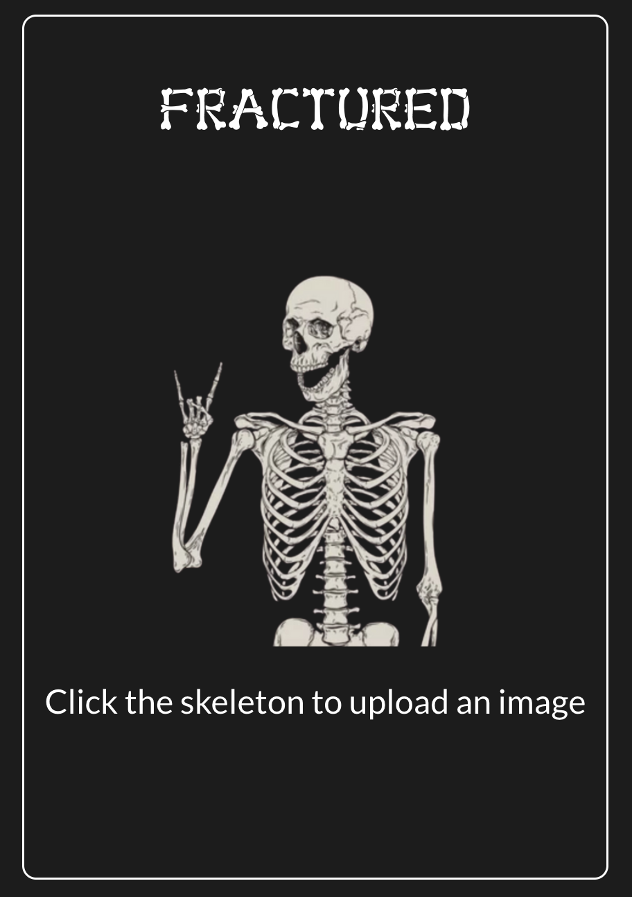
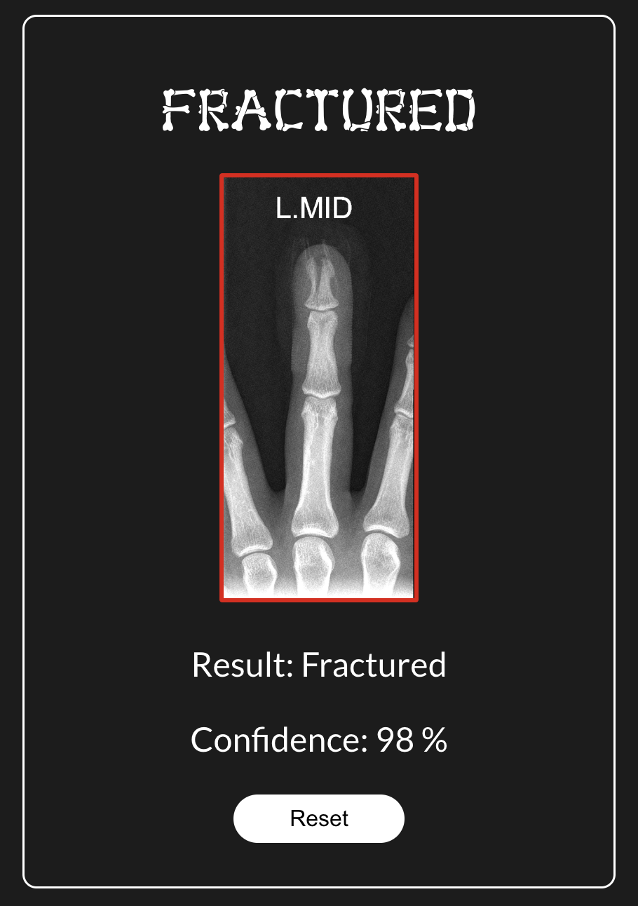
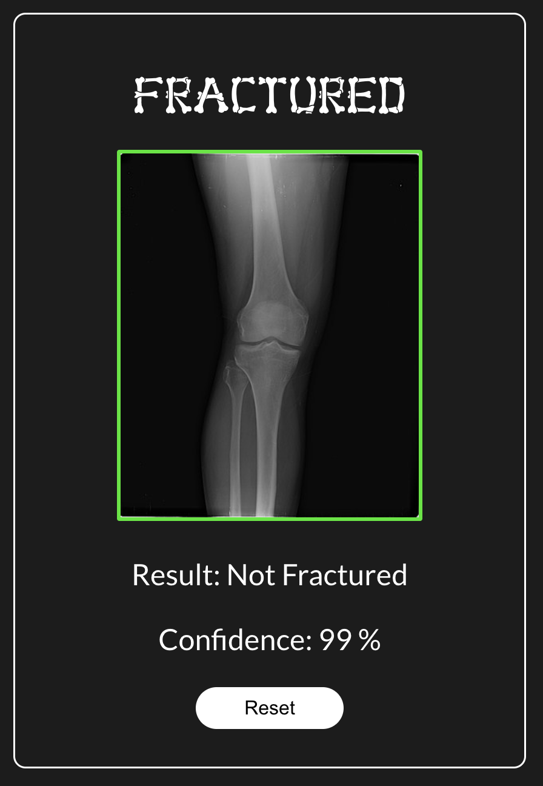

# - Work In Progress -
### Limb Fracture Identifier

### Summary

This application allows users to upload an x-ray image, which is then processed by a deep learning model. The model analyzes the image and returns a prediction along with a confidence percentage, indicating the likelihood of a fracture being present.

### Screenshots

